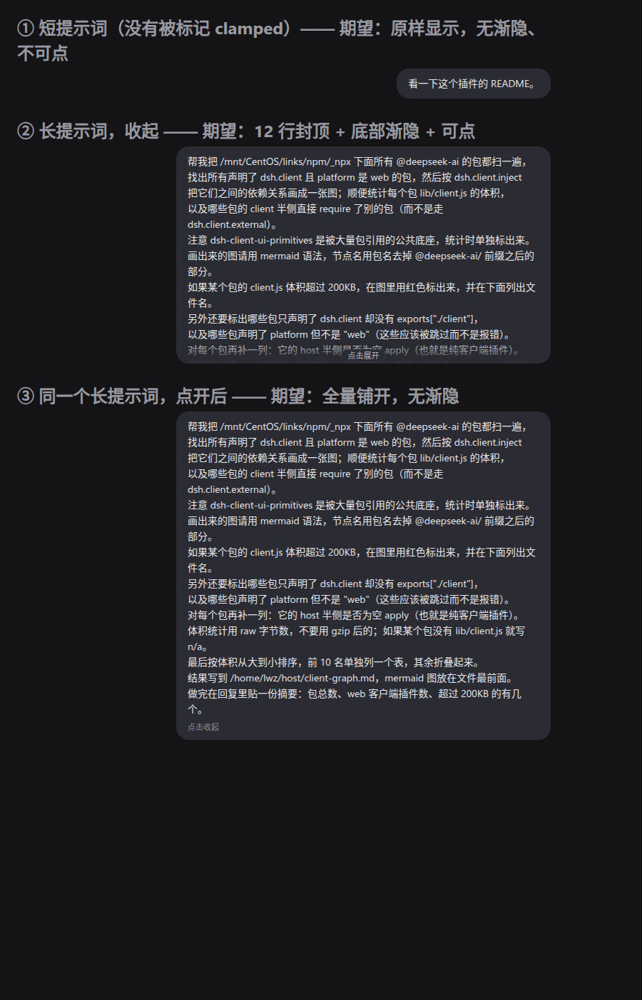

# dsh-plugin-ui-tweaks

**dsh Web GUI 的界面微调集合。** 一个插件装多项调整，后续新增功能只改 `lib/client.js`。

当前功能：

| 功能 | 状态 |
|---|---|
| 终端命令横幅：点击展开/收起完整命令 | ✅ 已实现 |
| 终端命令横幅：点提示符标签复制**原始命令** | ✅ 已实现 |
| 发出的长提示词（用户气泡）：超长自动折叠，点击展开 | ✅ 已实现 |
| 按区域设置字号（会话正文 / 终端卡片 / 代码块等） | ⏳ 预留 region，见下文 |

## 功能一：终端命令横幅

### 问题

`dsh-client-ui-primitives` 的 `TerminalBlock` 把命令横幅渲染成：

```css
.command {
  white-space: var(--dsl-terminal-command-whitespace, pre);
  overflow: hidden;
  text-overflow: ellipsis;
}
```

默认 `pre` 不换行 —— 比卡片宽的命令被 `…` 截断，而命令横幅本身**没有任何展开交互**（带展开按钮的只有输出区，且仅当输出行数超过 `maxLines`）。

组件留了出口：宿主把 `--dsl-terminal-command-whitespace` 重绑为 `pre-wrap`。后台任务面板（`dsh-client-ui-jobs`）已经这么做了，**聊天里的工具卡片（`dsh-client-ui-tool` 的 `.terminalBody`）漏了这一步**。

### 行为

两个手势共用一套"真·单击"闸门，命中区域互不重叠：

| 点哪里 | 发生什么 |
|---|---|
| 左侧提示符标签（`host` / `$`） | **复制完整原始命令**，标签原位变成绿色的「已复制」，1.2s 后还原；展开状态不变 |
| 横幅其它位置 | 在**收起 / 展开**之间切换，每张卡片各自记状态 |

- 命令横幅上 `cursor: pointer`，提示符标签上也是（hover 会亮一档）。
- **收起**：只显示命令的**第一行**，超宽处省略号截断；
- **展开**：显示**全部行**、完整换行，并解除横幅自身的 `max-height:150px` 限高与内部滚动，整条命令一次看全。
- 默认状态由 `lib/client.js` 的 `SETTINGS.commandExpandedByDefault` 决定：
  - `false`（当前）= 默认收起，点击展开；
  - `true` = 默认展开，点击收起。
- 卡片自带的「复制」按钮、输出区、卡片外的点击都不触发这两个手势。
- **只有"真·单击"才算**：主键、按下与松开位移 ≤ 4px、且当时没有活动选区。右（中）键、拖拽选择文本、双击选词、三击选行、按钮与输出区，全都不触发展开，也不触发复制，文本选择不受影响。
- 状态写在卡片根节点的 `data-ui-tweaks-command` 属性上；React 不管这个属性，所以流式输出和重渲染都不会丢（只有整行被卸载时才重置）。

### 为什么需要"复制命令"这个手势

命令横幅左侧的 `host` / `$` **不是命令内容**，是 `TerminalBlock` 渲染的提示符标签（`span.cwd`，与 `span.command` 是兄弟节点）：第 1 行显示 cwd 的最后一段，第 2 行起统一是字面量 `$`。

后果有两个，都很难受：

1. 它们是**真实 DOM 文本**，手工拖选命令会把 `host` / `$` 一起复制进去，粘出来根本不是能跑的命令；
2. 卡片右上角那个「复制」按钮复制的是**输出**，不是命令 —— 工具卡片没有传 `copyText`（`useCopyFeedback(copyText ?? text)`，只有后台任务面板传了 `copyText: job.label`）。

所以本插件给了第三个入口：点提示符标签，把原始命令从各个 `span.command` 里重新拼起来（`\n` 连接）写进剪贴板。收起状态下续行虽然 `display:none`，但**仍在 DOM 里**，所以两种状态都能复制全。

复制成功才显示"已复制"：`navigator.clipboard.writeText` 失败（或无此 API）时回退到隐藏 textarea + `document.execCommand("copy")`，两条路都失败就把标签还原，不会谎报成功。

### 为什么"收起"必须真的藏掉续行

`TerminalBlock` 会把命令的**每一行**都渲染进横幅，横幅自己只有 `max-height:150px` 加纵向滚动。所以只切换 `white-space` 的话，多行命令在"收起"状态下就已经把后面的行都列出来了（还得在内嵌滚动区里翻），点击后只是把行重新换行一遍、横幅高度不变——看起来就是"点了没展开"。因此本插件在收起状态下用 `display:none` 藏掉续行，展开时再解除限高，让两个状态真正不同。

### 横幅的 DOM 结构（结构选择器依赖它）

```
div[data-terminal]
├── div.header                 ← block 的第一个子元素；自带 max-height:150px + 纵向滚动
│   ├── div.prompt             ← header 的第一个子元素；命令行都挂在这里
│   │   ├── span.runStateLabel ← 视觉隐藏的状态文本
│   │   ├── div.promptLine     ← 第 1 行
│   │   └── div.promptLine × N ← 续行
│   ├── (状态 Pill) / (复制按钮)
└── (div.output)
```

续行用 `div:nth-of-type(n+2)` 选中，**不能用 `nth-child`**：前面那个隐藏的 `span.runStateLabel` 会让 `nth-child` 整体偏移一位，把第 1 行也一起藏掉。契约测试里有一条断言专门锁死这点。

另外，收起用的 `display:none` **刻意不做反向抵消**：默认状态由 `:not()` 规则表达，于是"还没点过"和"显式设成默认"命中同一条规则，展开那边不需要再声明 `display:flex` 去还原上游 `.promptLine` 的值——那等于复制一份上游的实现细节。

### 为什么必须区分"点击"和"选文本"

浏览器在「按下 → 拖动选中文本 → 松开」之后**照样会派发 `click`**。只按 `event.target` 判断的话，每一次选文本都会被当成点击：既误触切换，切换引起的重排又会把你刚选中的选区弄没（表现为"根本没法选文本"）。所以手势判定叠加了四道闸：

| 闸 | 拦住的场景 |
|---|---|
| `event.button === 0`（在 `mousedown` 记录） | 右/中键，包括左撇子按键映射之外的右键拖选 |
| 按下↔松开位移 ≤ 4px | 拖拽选择 |
| `document.getSelection()` 非折叠 | 拖完后选区还在的情况（含"在既有选区里单击"） |
| `event.detail > 1` + `dblclick` 回滚 | 双击选词、三击选行 |

前三条挡住误触；第四条是因为多击手势的第一下**长得和普通单击一样**，已经切过去了，所以 `dblclick` 到达时把它回滚（`MULTI_CLICK_REVERT_MS` 内、同一张卡片才回滚）。这样多击手势的净效果是"只选中、不切换"，而且不用给单击加任何延迟。

### 为什么点击不会和"行的展开/收起"打架

`DisclosureRow` 的 DOM 是两个**兄弟**节点：

```
div.root
├── div[data-disclosure-row]   ← 整行点击的展开/收起在这里
└── 展开后的卡片（TerminalBlock）  ← 在它外面
```

展开出来的卡片不在那个 `onClick` 里，所以在命令横幅上点击不会触发行级展开。**注意**：卡片投在命令横幅上的点击仍会向上冒泡，如果将来上层加了别的点击处理，需要重新评估。

### 改完 `lib/client.js` 怎么生效

宿主是在**配置组合时**读取插件 bundle 并把正文缓存在进程内的（`dsh-client-modules` 的 `lazyBody`），所以改完文件**光刷新页面不够**，需要一次配置重载让模块图重新组合：

- 在「设置 → 插件」里把本插件关一下再开；或
- 触碰 profile 的 `cordis.patch.yml` / `package.json`（`dsh-hmr` 监视这几个文件）；或
- 重启 `dsh web`。

重载后 rev 会变（内容哈希），页面刷新即拿到新字节。

## 功能二：发出的长提示词自动折叠

### 问题

用户气泡（`dsh-client-ui-chat` 的 `UserStyleBubble`）**没有任何高度策略**：

```css
.bubble { max-width: 100%; white-space: pre-wrap; padding: 10px 16px; }
```

所以一条很长的提示词会把整段对话顶开，想看后面的内容得一直滚。

### 行为



- **只有真正超长的才折叠**：默认最多 12 行（`SETTINGS.promptClampLines`），底部一段渐隐 + **居中的「点击展开」胶囊**；装得下的提示词完全不受影响，也**不可点**、不会出现任何提示。
- 折叠状态下点击气泡任意处 → 完整铺开，末尾显示「点击收起」；再点一下 → 收回。
- 点击气泡里的引用 chip（文件/skill 按钮）不会触发展开，拖拽选文本、右键、双击选词同样不会。
- 两处提示都是**生成内容**（`::before`/`::after`）并带 `user-select: none`，所以选中复制提示词时不会把「点击展开」一起带走。

### 为什么必须用 JS 量一次

CSS 判不出"内容是否溢出"，而这个功能**不能无条件套上限高**：给一条两行的提示词盖一层渐隐等于说谎。所以 `installPromptCollapse` 在气泡上量一次，把结论写成属性，样式再按属性走：

| 属性 | 谁写 | 含义 |
|---|---|---|
| `data-ui-tweaks-prompt-clamped` | 测量 | 内容超过上限，需要折叠 |
| `data-ui-tweaks-prompt-open` | 用户点击 | 当前展示全量 |

这个属性同时**兼任交互开关**：没被判定为超长的气泡，点击处理器直接返回，所以短提示词完全不可点。

**测量顺序不能反。** 限高只在 `data-ui-tweaks-prompt-clamped` 存在时才生效，而判定依据是 `scrollHeight > clientHeight` —— 如果先量后写属性，第一次测量时气泡还没被限高，`clientHeight` 就等于 `scrollHeight`，永远判不出超长，属性永远不写，死锁。正确顺序是**先戴上限高、量、装不下就留着、装得下就摘掉**：

```js
bubble.setAttribute(PROMPT_CLAMPED, "");
if (bubble.scrollHeight > bubble.clientHeight + 1) return;
bubble.removeAttribute(PROMPT_CLAMPED);
```

三件事都在同一个任务里完成，中间不会发生绘制，所以短提示词不会闪一下渐隐。（这一条我最初写反了，症状就是"历史长提示词完全不折叠"；契约测试的桩现在会模拟"限高只在标记存在时生效"这条 CSS 依赖，专门防回归。）

测量时机：安装时扫一遍历史消息 → `MutationObserver` 盯新出现的节点 → `window.resize` 时重测（窗口变窄可能让原本装得下的提示词变成超长）。

### 渐隐为什么是覆盖层而不是 mask

一开始底部渐隐是用 `mask-image` 做的，但**遮罩会把提示一起淡掉**——而提示正是这次要加的东西。所以改成覆盖层：

| 层 | 元素 | 作用 |
|---|---|---|
| 底 | `::before` | 34px 高，`background: inherit`（跟随气泡自己的底色）+ 自身 `mask-image` 做透明→不透明的过渡，压住被截断的那一行 |
| 面 | `::after` | 「点击展开」胶囊；`::after` 在 `::before` 之后绘制，所以压在渐隐之上仍然可读 |

用 `background: inherit` 而不是写死气泡颜色，是为了不把 `--dsw-specific-bubble` 这个主题 token 复制进插件。

### 气泡怎么定位（以及它有多脆）

和 `TerminalBlock` 不同，chat 包**没有给气泡任何 data 属性**。可用的只有：

- 外层流项 `[data-chat-flow-kind="user"]` —— `ChatView` 按节点 kind 写上去的，**稳定**；
- 气泡自身的 CSS-module 类名 —— 生成规则始终以源类名结尾（本包是 `Sixlwa_bubble`，其它包是 `_bubble_<hash>` 之类），所以 `[class*="_bubble"]` 跨构建可命中。

工具提示的类名里也有 `_bubble_`，但它 portal 到 `body`，永远不会出现在用户流项内部，所以不受影响。

## 目录结构

| 文件 | 作用 |
|---|---|
| `package.json` | 声明 `dsh.bundle.patch` 与 `dsh.client`（`platform: web`，`exports["./client"]`） |
| `cordis.patch.yml` | 组合包自激活：insert 一条 Loader 条目（**新增功能不需要改这里**） |
| `lib/index.js` | node 半侧：空 `apply()`，只为让 Loader 有条目 |
| `lib/client.js` | 浏览器半侧：`SETTINGS` + 每个功能一个 region + 末尾 assembly |

`lib/client.js` 的装配方式让新增功能只需两步：

1. 写一个 `xxxStyles()`（返回 CSS 文本）和一个可选的 `installXxx()`（返回 disposer）；
2. 把前者加进 `STYLES` 数组、后者加进 `BEHAVIOURS` 数组。

## 新增功能：按区域设置字号（预留）

`lib/client.js` 里已留好 `feature: region font sizes (planned)` region。相关变量：

| 区域 | 可重绑变量 |
|---|---|
| 全局内容次级字号 | `--dsh-content-font-size-secondary`、`--dsh-content-font-delta` |
| 终端卡片 | `--dsl-terminal-font`、`--dsl-terminal-line-height` |
| 代码块 | `--dsl-code-block-content-font` |
| read / diff / search 卡片 | 各自卡片前缀的字体变量 |

`dsh-client-ui-theme` 已经拥有全局 `fontSize` 设置（本 profile 的 patch 里是 15），按区域覆盖应当叠在它之上。

要接设置 UI 时，参照 `dsh-plugin-subscriptions` 的做法：`ctx.slots.inject("settings.section", …)` 注册一个设置区块，用 `ctx.locale.register()` 提供中英文案，`SETTINGS` 从 ctx 读取并在变更时重建 `<style>`。

## 安装 / 卸载

```sh
dsh plugin --profile web add /home/lwz/host/dsh-plugin-ui-tweaks
dsh plugin --profile web remove dsh-plugin-ui-tweaks
```

启用 HMR 时立即生效（`dsh-hmr` 监听 profile manifest 与 patch），否则重启 `dsh web`；装完刷新页面。

## 验证

- `F12` → Elements：终端卡片根节点（`data-terminal`）点击后应出现 `data-ui-tweaks-command="expanded"`；Computed 里 `--dsl-terminal-command-whitespace` 收起时是 `pre`、展开时是 `pre-wrap`。点提示符标签时应看到它变成绿色 `已复制`，且 `data-ui-tweaks-copied` 属性短暂出现。
- 发一条很长的提示词：气泡根节点应带上 `data-ui-tweaks-prompt-clamped`（Computed 里 `max-height` ≈ 284px），底部出现「点击展开」胶囊；点一下出现 `data-ui-tweaks-prompt-open`、限高与渐隐同时消失、末尾变成「点击收起」。发一条短的：两个属性都不该出现，也不该有任何提示。
- 页面上应存在 `<style data-plugin="dsh-plugin-ui-tweaks">`。
- 离线契约测试：`/tmp/dsh-plugin-check/ui-tweaks-contract-test.mjs`（**62 项**：注册、两个功能的样式规则、`nth-of-type` 与 `nth-child` 回归锁、单击切换、复制载荷与"已复制"反馈、`execCommand` 回退分支、初始扫描/`MutationObserver`/`resize` 三种测量时机、短提示词不可点、引用 chip 不误触、展开/收起两处提示且带 `user-select:none`、**右键/拖拽选择/双击选词/三击选行既不切换也不复制也不展开**、多卡片独立、三个 effect 的 disposer 回收）。测试从源码里的 `commandExpandedByDefault` / `copiedFeedback` / `promptClampLines` / `promptExpandHint` / `promptCollapseHint` 推导期望值，改这些不需要动测试。
- 视觉对照件：`build-fixture.mjs` 与 `build-prompt-fixture.mjs` 用**真实 DOM 结构 + 真实样式声明 + 插件实际生成的 CSS** 渲染对照，再用无头 Chrome 截图核对：见 [`docs/banner-states.png`](docs/banner-states.png) 与 [`docs/sent-prompt-collapse.png`](docs/sent-prompt-collapse.png)。

## 已知限制

- 终端横幅依赖三层结构约定：根节点带 `data-terminal`；命令横幅是它的**第一个子元素**；命令行是横幅内第一层 `div` 的后代 `div`，每行最后一个子元素是命令、倒数第二个是提示符标签。
- 长提示词折叠依赖 `[data-chat-flow-kind="user"]`（稳定）加上 `[class*="_bubble"]`（CSS-module 类名后缀）。上游若把源类名 `bubble` 改名，折叠会静默失效——**不会误伤别的元素**，因为作用域被流项属性限死。
- 折叠态会给气泡加上 `position: relative`（覆盖层与提示的定位基准）。若上游以后在气泡里塞了依赖"最近定位祖先"的浮层，需要重新评估；目前气泡内的引用 chip 用的是 `position: fixed` 弹层，不受影响。
- 两处提示是 CSS 生成内容，因此无法被读屏软件按按钮语义播报（`content` 会作为文本被朗读，但没有 `role`）。要真正可访问得上游给一个真按钮。
- 上游若改动这两处结构，表现都是"功能静默失效"，不会报错、不会破坏页面。
- 折叠测量依赖 `MutationObserver`：聊天流式输出期间会有回调，但每次只对**新增元素**做 `matches`/`querySelectorAll`，只有真的找到气泡才会触发一次布局读取。
- 「已复制」是**替换提示符标签的文本**实现的。React 在文本 prop 未变时不会重写该文本节点，所以反馈期间的重渲染不会打断它；反馈窗口（1.2s）内如果这张卡片被卸载，定时器只会写到一个已脱离文档的节点上，无副作用。
- 文案 `已复制` 目前硬编码在 `SETTINGS.copiedFeedback`（本包还没有 locale 席位）。接设置页时应改用 `ctx.locale`。
- 折叠状态不持久化：切换会话后消息重新渲染，长提示词回到默认折叠。要记住状态得按消息 key 存一份，属于设置页那一轮的事。
- 点击手势只有鼠标路径，没有键盘入口（气泡不是按钮、横幅也不可聚焦；加 `role="button"` 会和内部已有的真实按钮冲突）。要键盘支持应在上游做。
- 手势判定用的是 `mousedown` + `click`（鼠标事件），触点长按选择的行为取决于浏览器合成的事件序列，未单独适配。
- 点击事件绑在 document 上、只做常数次 `closest` 判断，不观察 DOM 树（除折叠功能那一个 observer），因此对长会话没有额外开销。
# dsh-plugin-ui-tweaks
